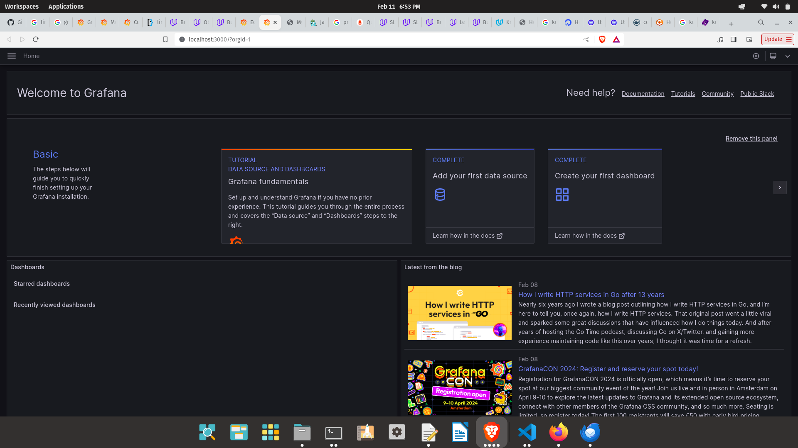
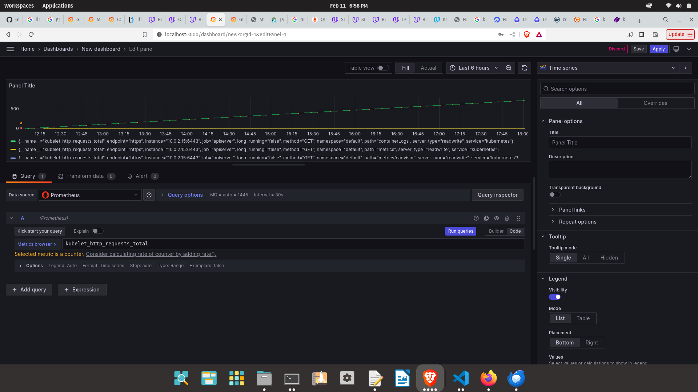

**Note:** For the screenshots, you can store all of your answer images in the `answer-img` directory.

## Verify the monitoring installation

*VerifyMonitoringInstallation.png* run `kubectl` command to show the running pods and services for all components. Take a screenshot of the output and include it here to verify the installation

## Setup the Jaeger and Prometheus source
*GrafanaHomePage.png* Expose Grafana to the internet and then setup Prometheus as a data source. Provide a screenshot of the home page after logging into Grafana.

## Create a Basic Dashboard
*PrometheusDashboard.png* Create a dashboard in Grafana that shows Prometheus as a source. Take a screenshot and include it here.

## Describe SLO/SLI
The SLIs are measurements that provide evidence that a SLO is being upheld.

## Creating SLI metrics.
+ 95% monthly uptime
+ The average request response time will be 300 ms.
+ Not a single request will be > 1 second.
+ Between the hours of 1600 and 1700 - peak time - there won't be any system downtime.
+ Between the hours of 1600 and 1700 the average request response time will be <= 150 ms. 

## Create a Dashboard to measure our SLIs
Create a dashboard to measure the uptime of the frontend and backend services We will also want to measure to measure 40x and 50x errors. Create a dashboard that show these values over a 24 hour period and take a screenshot.

## Tracing our Flask App
Also provide a (screenshot) sample Python file containing a trace and span code used to perform Jaeger traces on the backend service.

## Jaeger in Dashboards
Now that the trace is running, let's add the metric to our current Grafana dashboard. Once this is completed, provide a screenshot of it here.

## Report Error
*TODO:* Using the template below, write a trouble ticket for the developers, to explain the errors that you are seeing (400, 500, latency) and to let them know the file that is causing the issue also include a screenshot of the tracer span to demonstrate how we can user a tracer to locate errors easily.

TROUBLE TICKET

Name: John P. Johnson

Date: 25 Feb 2024

Subject: 500 errors for the localhost:8081/star endpoint

Affected Area: the localhost:8081/star endpoint

Severity: High

Description: Starting at 1400 on 25 Feb 2024 the localhost:8081/star endpoint starting producing 500 errors. Please see asttached image named TraceSpanCode.png Using the Jaeger UI I was able to obtain the following log message:

"example-mongodb-svc.default.svc.cluster.local:27017: [Errno -2] Name or service not known, Timeout: 30s, Topology Description: <TopologyDescription id: 65db8f89517d76bfe2832d35, topology_type: Single, servers: [<ServerDescription ('example-mongodb-svc.default.svc.cluster.local', 27017) server_type: Unknown, rtt: None, error=AutoReconnect('example-mongodb-svc.default.svc.cluster.local:27017: [Errno -2] Name or service not known')>]>""

The most relevant part of the stack trace is the following: 

" File "/app/app.py", line 74, in add_star
    star_id = star.insert({"name": name, "distance": distance})"    

## Creating SLIs and SLOs
+ The average request response time will be 300 ms.
+ The total amount of 40X and 50X errors will not exceed the denominator of all requests such that the application's uptime is >= 99.95%
+ Not a single request will be > 1 second.
+ Once a 40X and/or 50X error occurs there will not be > 5 consecutive ones in a 30 minute time span.

## Building KPIs for our plan
+ Server Uptime.         This is the most important Key Performance Indicator as if the server isn't available the client cannot do anything. If
                         your cloud has bad server uptime you will quickly get a reputation as being unreliable and will consequently have great
                         difficulty retaining and attracting customers. 
                           a. Ratio of requests: 40X and 50X will be the numerator and all requests will be the denominator over the course of 30 days.
                         
+ Average Response Time. Years ago I watched a documentary on Amazon.com which described how Amazon observed that when the response time of their
                          website exceeded a number a large amount of users exited the website. Therefore I think the Average Response Time is the
                          second most important KPI. 
                            b. Number of requests > 1 second: The total number of requests that are over 1 second over the course of 30 days
                            c. Average of response time: the total number of requests divided by the total request time
                            d. Number of consecutive 40X and/or 50X errors: the total amount of consecutive 40X and/or 50X errors over 30 days.

+ The aggregate 40X and 50X errors won't exceed the denominator of all requests such that the application's uptime is >= 99.95%
+ The average response time won't be > 300 ms.

## Final Dashboard
Create a Dashboard containing graphs that capture all the metrics of your KPIs and adequately representing your SLIs and SLOs. Include a screenshot of the dashboard here, and write a text description of what graphs are represented in the dashboard.

